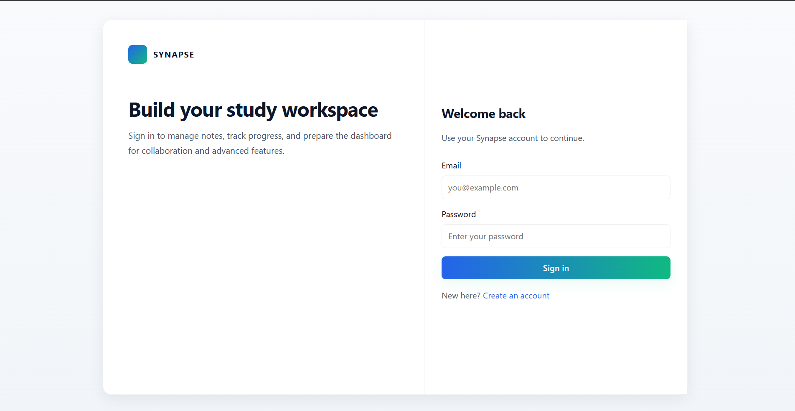
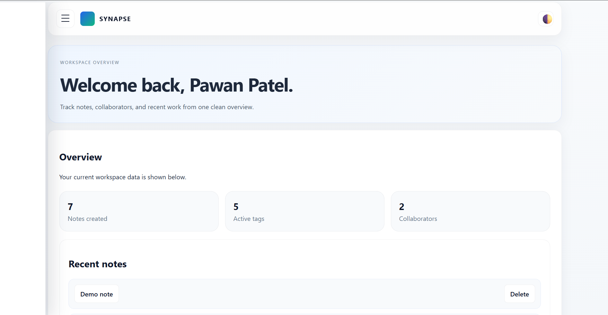
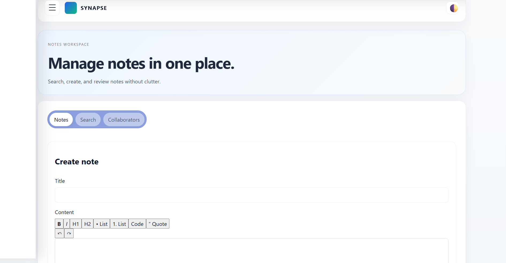
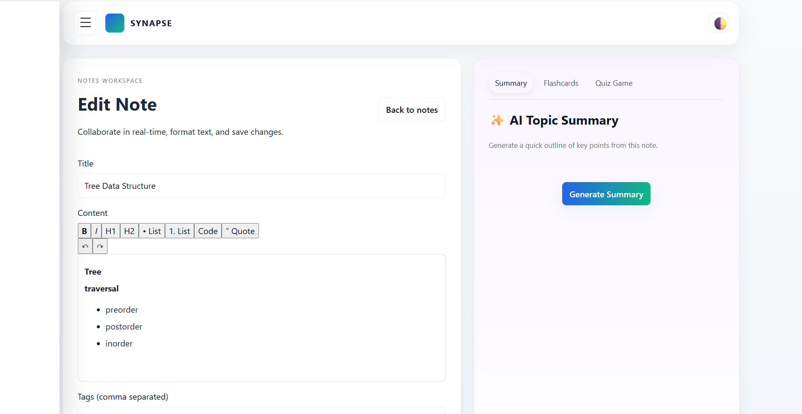
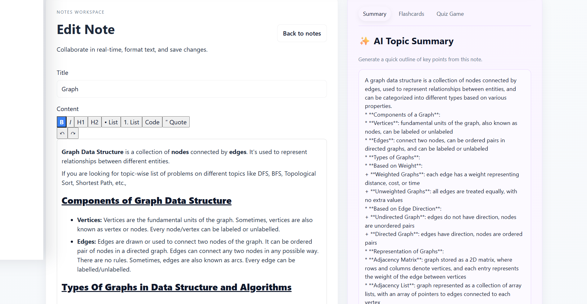
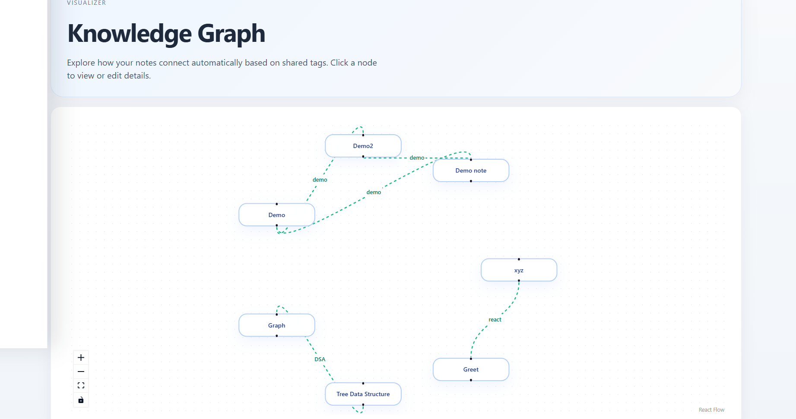
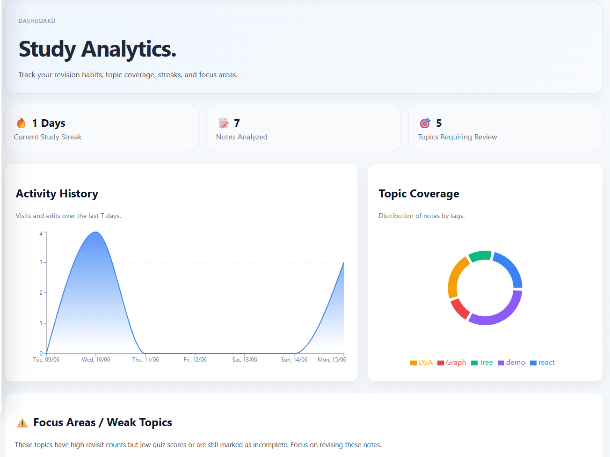

# Synapse

> An AI-powered collaborative knowledge management platform built with the MERN stack.

Synapse helps users create, organize, connect, summarize, and collaborate on notes in real time. It combines rich note-taking, intelligent knowledge discovery, AI-generated summaries, and live collaboration into a unified workspace.

---

## 🚀 Features

### 🔐 Authentication & Security

- JWT Authentication
- Secure Password Hashing (bcrypt)
- Protected Routes
- User-specific Data Access

---

### 📝 Rich Note Taking

- Create, Edit, Delete Notes
- Rich Text Editor using TipTap
- Headings, Lists, Formatting
- Tag Management
- Organized Note Workspace

---

### 🤝 Real-Time Collaboration

- Multi-user Collaboration
- Live Updates using Socket.IO
- Shared Notes
- Collaborator Management
- Permission-Based Access

---

### 🔍 Smart Search

- Search by Title
- Search by Content
- Search by Tags
- Search by Collaborators
- Instant Filtering

---

### 🧠 AI Note Summarization

- AI-generated Summaries
- Key Information Extraction
- Quick Note Overview
- Productivity Enhancement

---

### 🌐 Knowledge Connections

Synapse automatically connects notes through shared tags.

Example:

Note A:
- React
- JavaScript
- Frontend

Note B:
- React
- Hooks
- State Management

Because both notes contain the **React** tag, Synapse links them as related content.

Features:

- Related Note Discovery
- Tag-Based Knowledge Network
- Connected Learning Experience
- Knowledge Exploration

---

## 🏗️ Tech Stack

### Frontend

- React
- React Router
- Context API
- Axios
- TipTap
- Socket.IO Client

### Backend

- Node.js
- Express.js
- MongoDB
- Mongoose
- JWT
- bcrypt
- Socket.IO

### AI

- AI-powered note summarization
- LLM integration

### Database

- MongoDB Atlas

---

## 📂 Project Structure

```text
Synapse
│
├── frontend
│   ├── src
│   │   ├── components
│   │   ├── pages
│   │   ├── context
│   │   ├── services
│   │   └── routes
│
├── backend
│   ├── controllers
│   ├── middleware
│   ├── models
│   ├── routes
│   ├── services
│   └── sockets
│
└── README.md
```

---

## ⚙️ Installation

### Clone Repository

```bash
git clone https://github.com/yourusername/synapse.git
cd synapse
```

### Backend

```bash
cd backend
npm install
```

Create `.env`

```env
PORT=5000
MONGO_URI=your_mongodb_connection_string
JWT_SECRET=your_secret_key
AI_API_KEY=your_api_key
```

Start backend:

```bash
npm run dev
```

### Frontend

```bash
cd frontend
npm install
npm run dev
```

---

## 📸 Screenshots

### Login Page



### Dashboard



### Notes Workspace



### Rich Text Editor



### AI Summarization




### Knowledge Connections



### Study Analysis



---

## 🔌 API Endpoints

### Authentication

```http
POST /api/auth/register
POST /api/auth/login
GET /api/auth/profile
```

### Notes

```http
GET    /api/notes
GET    /api/notes/:id
POST   /api/notes
PUT    /api/notes/:id
DELETE /api/notes/:id
```

### Collaboration

```http
POST /api/notes/:id/share
GET  /api/notes/:id/collaborators
```

### AI

```http
POST /api/notes/:id/summarize
```

---

## 🏛️ Architecture

```text
                    ┌─────────────┐
                    │    React    │
                    └──────┬──────┘
                           │
                           ▼
                    ┌─────────────┐
                    │ Express API │
                    └──────┬──────┘
                           │
         ┌─────────────────┼─────────────────┐
         ▼                 ▼                 ▼
   MongoDB Atlas      Socket.IO        AI Service
      Storage       Collaboration     Summaries
```

---


## 🔮 Future Improvements

- Version History
- Semantic Search using Embeddings
- AI Chat with Notes
- Workspace Management
- Document Export (PDF/Markdown)
- Mobile Application

---

## 👨‍💻 Author

**Pawan Patel**


