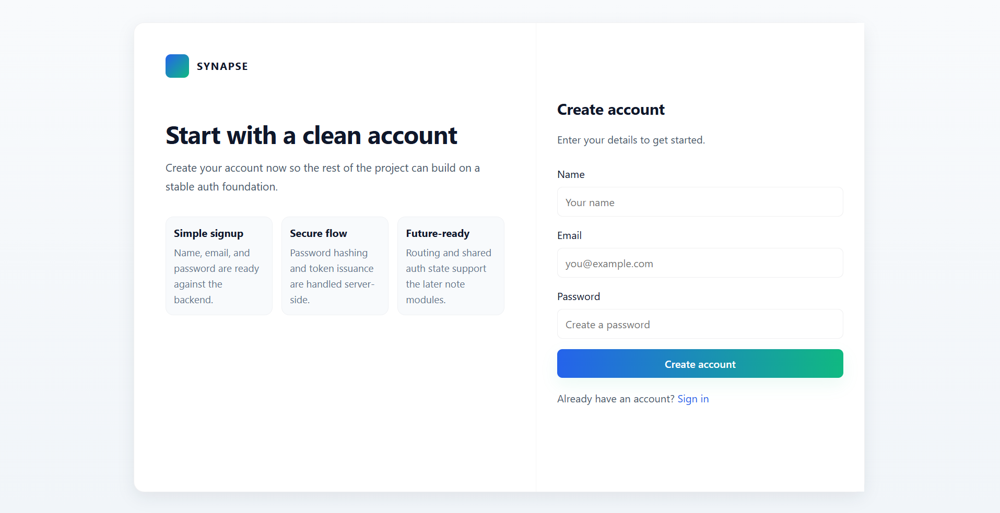

# Synapse

> A collaborative knowledge management platform built using the MERN stack.

Synapse helps users create, organize, search, and share notes efficiently. It provides rich text editing, note collaboration, tag-based knowledge connections, and an intuitive workspace for managing information.

---

## 🚀 Features

### 🔐 Authentication & Security

- User Registration & Login
- JWT Authentication
- Protected Routes
- Secure Password Hashing with bcrypt

### 📝 Notes Management

- Create Notes
- Edit Notes
- Delete Notes
- Rich Text Editing with TipTap
- Tag Support
- Auto-organized Workspace

### 🤝 Collaboration

- Add Collaborators to Notes
- Shared Note Access
- Collaborator Management
- Access Control System

### 🔍 Search & Discovery

- Search by Title
- Search by Content
- Search by Tags
- Search by Collaborators

### 🧠 Knowledge Connections

- Automatically connects notes using common tags
- Related Notes Suggestions
- Knowledge Discovery through shared topics

Example:

Note A:
- React
- JavaScript
- Frontend

Note B:
- React
- Hooks
- State Management

Since both notes contain the **React** tag, Synapse identifies them as related notes.

---

## 🛠️ Tech Stack

### Frontend

- React
- React Router
- Context API
- Axios
- TipTap Editor
- CSS

### Backend

- Node.js
- Express.js
- MongoDB
- Mongoose
- JWT
- bcrypt

### Database

- MongoDB Atlas

### Deployment

- Vercel
- Render / Railway

---

## 📂 Project Structure

```text
Synapse
│
├── frontend
│   ├── src
│   │   ├── components
│   │   ├── pages
│   │   ├── context
│   │   ├── services
│   │   └── routes
│   │
│   └── public
│
├── backend
│   ├── config
│   ├── controllers
│   ├── middleware
│   ├── models
│   └── routes
│
└── README.md
```

---

## ⚙️ Installation

### Clone Repository

```bash
git clone https://github.com/yourusername/synapse.git
cd synapse
```

### Backend Setup

```bash
cd backend
npm install
```

Create `.env`

```env
PORT=5000
MONGO_URI=your_mongodb_connection_string
JWT_SECRET=your_secret_key
```

Run backend:

```bash
npm run dev
```

### Frontend Setup

```bash
cd frontend
npm install
npm run dev
```

---

## 📡 API Endpoints

### Authentication

```http
POST /api/auth/register
POST /api/auth/login
GET  /api/auth/profile
```

### Notes

```http
GET    /api/notes
GET    /api/notes/:id
POST   /api/notes
PUT    /api/notes/:id
DELETE /api/notes/:id
```

---

## 📸 Screenshots

### Login Page


---

### Register Page



---

### Dashboard


---

### Notes Workspace


---

### Rich Text Editor


---

### Search Notes


---

### Collaborators Panel


---

### Edit Note


---

## 🏗️ Architecture

```text
React Frontend
      |
      |
      v
 Express API
      |
      |
      v
   MongoDB
```

---

## ✨ Resume Highlights

- Built a full-stack collaborative note-taking platform using MERN Stack.
- Implemented JWT-based authentication and authorization.
- Developed a rich text editor using TipTap.
- Created tag-based knowledge connections between notes.
- Implemented collaborator-based note sharing.
- Designed RESTful APIs for note and user management.
- Built advanced search functionality across notes, tags, and collaborators.

---

## 🔮 Future Enhancements

- Real-time collaboration with Socket.IO
- Version History
- AI Note Summarization
- Semantic Search
- Workspace Support
- PDF Export
- Activity Tracking

---

## 👨‍💻 Author

**Pawan Patel**

B.Tech Student | Aspiring Software Development Engineer

---

⭐ Star the repository if you found it useful.
